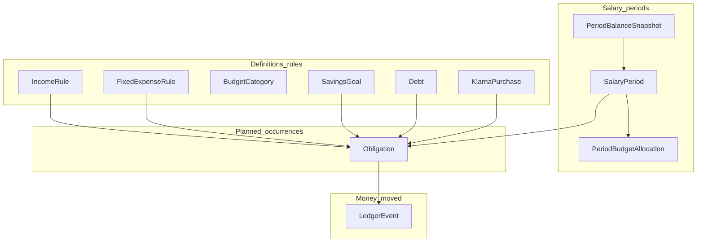
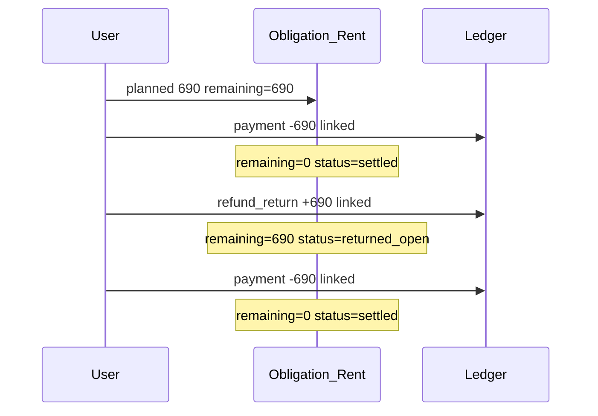
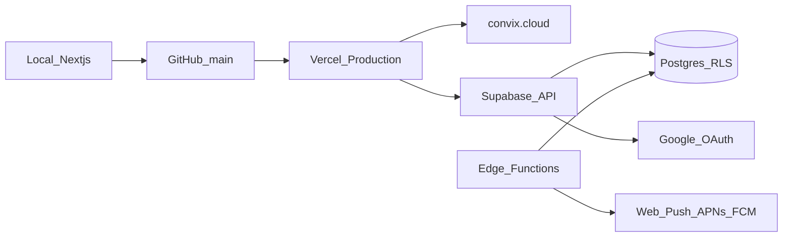

# Convix V1 — Technical Implementation Plan

## 1. Executive summary

Convix V1 is a **manual-entry personal finance cockpit** whose primary job is answering: *“How much can I safely spend until my next salary?”*

**Architecture in one sentence:** Next.js App Router (TypeScript) on Vercel, talking to Supabase (Auth + Postgres + RLS + Edge Functions), installed as a PWA, with a server-side **salary-period calculation engine** that derives Free Spendable from confirmed balances, planned obligations, budgets, savings, debts, and Klarna installments—never from blind trust of calculated cash.

**Core design principles**

| Principle | Why |
|---|---|
| Free Spendable ≠ bank balance | Obligations and reserved budgets must be subtracted before spending |
| Actual bank balance is source of truth at period start | Manual confirmation corrects drift and makes carry-over visible |
| Rules vs occurrences vs ledger events | Recurring definitions ≠ planned dues ≠ money that moved |
| Obligations survive failed/returned payments | Debit + refund ≠ settlement |
| Savings leave spendable wealth | Treat contributions as spend-out, not neutral transfers |
| Ship live shell first | Phone testing of PWA/auth before finance complexity |

**Recommended stack (locked)**

- **App:** Next.js 15 (App Router) + React 19 + TypeScript `strict`
- **UI:** Tailwind CSS + shadcn/ui (mobile-first components)
- **Data:** Supabase Postgres + Supabase Auth (Google OAuth) + RLS on every table
- **Host:** Vercel (production = `convix.cloud`)
- **Repo:** GitHub (`main` + short-lived feature branches)
- **PWA:** `@serwist/next` (or equivalent) — manifest + service worker + icons
- **Push (Phase 11):** Web Push (VAPID) via Supabase Edge Function + stored push subscriptions
- **Money:** integer **cents** in EUR only for V1 (no float)

---

## 2. Recommended project structure

```
convix/
├── apps/web/                    # or flat root if monorepo not needed
│   ├── app/                     # Next.js App Router
│   │   ├── (auth)/              # login, OAuth callback
│   │   ├── (app)/               # authenticated shell
│   │   │   ├── page.tsx         # Dashboard
│   │   │   ├── timeline/
│   │   │   ├── expenses/new/    # quick entry
│   │   │   ├── budgets/
│   │   │   ├── accounts/
│   │   │   ├── klarna/
│   │   │   ├── savings/
│   │   │   ├── debts/
│   │   │   ├── income/
│   │   │   ├── fixed/
│   │   │   ├── insights/
│   │   │   ├── settings/
│   │   │   └── onboarding/
│   │   ├── api/                 # Route handlers (webhooks, push admin)
│   │   ├── layout.tsx
│   │   ├── manifest.ts
│   │   └── sw.ts                # Serwist service worker entry
│   ├── components/
│   │   ├── ui/                  # shadcn
│   │   ├── dashboard/
│   │   ├── timeline/
│   │   ├── money/               # FreeSpendableHero, AmountInput
│   │   └── navigation/          # bottom tab bar
│   ├── lib/
│   │   ├── supabase/            # browser + server clients
│   │   ├── money/               # cents helpers, formatting
│   │   ├── periods/             # salary period date math
│   │   ├── calc/                # Free Spendable engine (pure functions)
│   │   ├── obligations/         # materialize / settle / refund
│   │   └── validations/         # Zod schemas
│   ├── supabase/
│   │   ├── migrations/          # SQL migrations
│   │   └── seed/                # optional local seed
│   ├── public/icons/
│   └── tests/
│       ├── unit/calc/
│       └── integration/
├── docs/                        # setup checklists (Phase 1)
└── package.json
```

**Why flat-or-single-app, not microservices:** One developer, one product surface, one deploy URL. Supabase Edge Functions only where the Next.js server cannot (scheduled jobs, push fan-out).

---

## 3. Database / domain model

### Conceptual layers



### Recommended tables (normalized)

**Identity**
- `profiles` — `id` (= `auth.users.id`), `display_name`, `salary_day` (default `24`), `currency` (`EUR`), `timezone`, `onboarding_completed_at`, `created_at`

**Accounts**
- `accounts` — `id`, `user_id`, `name`, `type` (`checking` | `savings` | `other`), `is_active`, `sort_order`, `created_at`
- Note: balances live in snapshots/ledger, not as a mutable “truth” column alone. Keep `last_confirmed_balance_cents` + `last_confirmed_at` as cache for UX.

**Salary periods**
- `salary_periods` — `id`, `user_id`, `starts_on` (date), `ends_on` (date), `status` (`open` | `closed`), `expected_available_cents`, `actual_available_cents` (nullable until confirmed), `carry_over_cents`, `balance_confirmed_at`
- Unique `(user_id, starts_on)`

**Period balance confirmation (multi-account)**
- `period_account_balances` — `period_id`, `account_id`, `expected_cents`, `actual_cents`, `carry_over_cents`
- Free Spendable starting point = sum of **spendable accounts’** confirmed balances (see Account model decisions)

**Recurring / one-time income**
- `income_rules` — name, amount_cents, recurrence (`monthly` | `yearly` | `once`), day_of_month / month+day, account_id, active, starts_on, ends_on
- Occurrences materialize as `obligations` with `kind = income` (positive)

**Fixed expenses (incl. joint contribution, annual)**
- `fixed_expense_rules` — name, amount_cents, category, recurrence (`monthly` | `yearly` | `once`), due day/month, account_id, active
- **Annual: full amount in the period containing the due date** (never ÷12)

**Variable budgets**
- `budget_categories` — name, icon/color optional, active, default_amount_cents
- `period_budgets` — `period_id`, `category_id`, `allocated_cents` (reset each period; no unused rollover)

**Unified obligations (planned future/past dues)**
- `obligations` — see §6
  - Covers fixed, income, savings contribution, debt payment, Klarna installment, one-off planned items
  - **Materialize** for current + next period (and any open unsettled historical); UI can project further dynamically if needed

**Ledger (actual money movements)**
- `ledger_events` — see §6 / §8
  - Types: `payment`, `income`, `refund_return`, `savings_contribution`, `debt_payment`, `balance_adjustment`, `expense`
  - Links optionally to `obligation_id`, `account_id`, `budget_category_id`, `klarna_purchase_id`, etc.

**Savings**
- `savings_goals` — name, current_amount_cents, target_amount_cents nullable, scheduled_amount_cents, cadence, contribution_day, active, linked_account_id optional
- Contributions create obligations + on pay create ledger events that **increase** `current_amount_cents` and reduce Free Spendable

**Debts**
- `debts` — name, outstanding_cents, active
- `debt_payment_rules` — amount_cents, day_of_month / next_due, active
- Payments reduce `outstanding_cents` only when settled successfully

**Klarna**
- `klarna_purchases` — merchant/name, total_cents, purchased_on, plan (`pay_in_30` | `pay_in_3` | `custom`), status
- `klarna_installments` — purchase_id, sequence, due_on, amount_cents, obligation_id, status
- Purchase event itself is an informational timeline item; **cash impact is on installments** (except “pay now” part of pay-in-3)

**Notifications**
- `push_subscriptions` — endpoint, keys, user_agent, created_at
- `notification_preferences` — per event type booleans
- `notification_log` — sent events (dedupe)

**Why materialize obligations (chosen approach)**

| Approach | Pros | Cons |
|---|---|---|
| Fully dynamic | Less storage | Hard to attach refunds/settlements; race conditions; audit weak |
| Fully materialize years ahead | Simple queries | Stale on rule edits; bloat |
| **Hybrid (chosen):** materialize current + next period (+ unsettled) | Stable IDs for settlement/refund; Free Spendable is a DB query; rematerialize on rule change | Need rematerialization jobs |

**Rematerialize triggers:** period open, rule create/update/deactivate, Klarna purchase created, debt rule change.

---

## 4. Financial calculation model (Free Spendable)

### Definitions

- **Spendable pool accounts:** checking (+ optionally “other”); **exclude** dedicated savings accounts from Free Spendable starting cash (savings goals track reserved wealth separately). *Decision to approve: see §24.*
- **Starting available (period):** sum of confirmed `actual_cents` on spendable accounts at period open (or onboarding).
- **Income in period:** planned/settled income obligations for display and Binnenkort. **Unpaid expected income does not inflate Free Spendable** — cash only rises when income is settled (ledger) or included in a confirmed bank balance.
- **Reserved variable budgets:** sum over categories of `max(0, allocated − spent_assigned)` for the open period. Spent assigned = sum of actual expense ledger events in category. Overspend does **not** create negative reserve (already spent extra reduces Free Spendable via the expense itself).
- **Future fixed / Klarna / debt / savings obligations:** sum of obligations in this period with status in (`planned`, `due`, `partially_paid`, `returned_open`) of their **remaining_open_cents**.
- **Already paid:** settled obligations do not reserve again; their cash left via ledger events already reflected in… wait — **important:** because starting balance is **actual bank balance**, past payments already reduced the bank. Therefore:

### Critical accounting rule (must approve)

**Free Spendable for an open period uses the latest confirmed bank balance as cash basis, then only subtracts STILL-OPEN future reservations and remaining budget reserves; it does NOT re-subtract historical settled expenses that already hit the bank.**

Two operating modes:

1. **At period start (just confirmed):**  
   `FS = actual_available − open_future_obligations_remaining − remaining_budget_allocations`

2. **During the period after expenses:**  
   Actual expenses already reduced the real bank, but we may not re-confirm balance daily. Therefore maintain:

```
tracked_cash ≈ last_confirmed_actual
  + income_settled_since_confirm
  − expenses_settled_since_confirm
  − savings_settled_since_confirm
  − debt_payments_settled_since_confirm
  ± refunds_since_confirm
```

Then:

```
FreeSpendable =
  tracked_cash
  − remaining_open_obligations_this_period   // fixed, klarna, debt, savings due
  − remaining_unspent_budget_allocations      // reserved, not yet spent
```

Unpaid expected income is shown in Binnenkort / Inkomen, not added to Free Spendable.

**Already-paid expenses are not deducted twice:** they reduce `tracked_cash` once via ledger; they reduce remaining budget reserve; they do **not** also appear in open obligations.

### Worked example A — mid-period

Assumptions (period 24 Sep → 23 Oct):

| Item | Amount |
|---|---|
| Confirmed actual available (24 Sep) | €2,058 |
| Salary already included in bank | yes |
| Fixed still open: Rent 1 Oct | €690 |
| Fixed still open: Phone 5 Oct | €35 |
| Variable budgets allocated | Groceries €400, Fuel €250, Fun €100 (= €750) |
| Spent so far: Groceries | €42 |
| Spent so far: Coffee (uncategorized) | €4.50 |
| Savings due 30 Sep | €100 |
| Klarna due 3 Oct | €100 |
| Expected other income | €0 |

```
tracked_cash = 2058 − 42 − 4.50 = 2011.50
remaining_budgets = (400−42) + 250 + 100 = 708
open_obligations = 690 + 35 + 100 + 100 = 925
FS = 2011.50 − 708 − 925 = 378.50
```

### Worked example B — carry-over at period start

| | |
|---|---|
| Expected available | €312 |
| User enters actual | €428 |
| Carry-over recorded | +€116 |

New FS basis starts from **€428**, not €312. If actual were €250 vs expected €312, basis = **€250**, discrepancy **−€62** shown as warning.

### Worked example C — annual expense

Car insurance €1,200 due 1 Dec → entire €1,200 reserved in the salary period containing 1 Dec (24 Nov → 23 Dec). Not €100/month.

### Worked example D — budget overspend

Groceries allocated €400, spent €437 → remaining reserve for groceries = €0; the extra €37 already left via `tracked_cash`. Display: `€437 / €400 · €37 over`. Entry never blocked.

---

## 5. Salary-period logic

- Period = `[salary_day, next_month(salary_day) − 1 day]` inclusive.
- Default `salary_day = 24` (profile field; **configurable**, not hardcoded forever).
- On calendar date = salary_day: **open new period** (idempotent job + on app open check).
- Period open checklist (automated + UX):
  1. Close previous period
  2. Compute expected available from tracked_cash of previous
  3. Materialize obligations for new period (income, fixed, savings, debt, Klarna dues)
  4. Reset `period_budgets` from category defaults (no unused rollover)
  5. Prompt: “Confirm actual bank balance(s)”
  6. Store expected vs actual vs carry-over per account
  7. Insights/notifications: period started, confirm balance

**Weekend/holiday:** do **not** shift salary day in V1.

---

## 6. Transaction / obligation state model

### Obligation statuses

```
planned → due → (payment attempted)
              ↘ settled
              ↘ returned_open  → (payment attempted again) → settled
              ↘ cancelled (only if user voids the rule occurrence explicitly)
              ↘ waived (rare; user marks no longer owed)
```

Fields: `amount_cents`, `remaining_open_cents`, `kind`, `due_on`, `period_id`, `source_type/source_id`, `budget_category_id?`, `account_id?`

### Ledger event types (immutable append-only)

| type | effect on tracked_cash | effect on obligation |
|---|---|---|
| `expense` / `payment` | −amount | reduces remaining; may settle |
| `income` | +amount | settles income obligation |
| `refund_return` | +amount | **reopens** or increases remaining; does **not** cancel |
| `savings_contribution` | −amount | settles savings obligation; +goal balance |
| `debt_payment` | −amount | settles; −debt outstanding |
| `balance_adjustment` | ±amount | none (manual correction) |

**Settlement rule:** obligation `settled` iff `remaining_open_cents = 0` after netting payments − returns linked to it.

**Returned payment flow:** see §8.

---

## 7. Klarna model

- Purchase creates `klarna_purchases` + timeline “purchase” (informational).
- **Pay in 30:** one installment due `purchased_on + 30 days` (date math; no weekend shift).
- **Pay in 3:** installment 1 due purchase day (immediate cash out), 2 ≈ +1 month, 3 ≈ +2 months (same day-of-month or clamped).
- Each installment → `obligations` with `kind = klarna_installment`.
- Free Spendable impacted **only in the salary period containing the installment due date** (except immediate part of pay-in-3, which hits current period cash when paid).
- Dedicated Klarna screen: outstanding total, purchases, schedule, paid/unpaid, dues.

**Example:** Purchase 23 Sep €100 pay-in-30 → due 23 Oct → October period (24 Sep–23 Oct) includes that due if 23 Oct is inside it — **yes, 23 Oct is last day of Sep24–Oct23 period.** Flag for user: edge case “due on period end day” is included in that period.

---

## 8. Refund / returned-payment model



- UI labels: Attempted payment · Returned · Still owed · Settled
- Timeline shows all three events distinctly
- Free Spendable: after return, cash up and obligation open again → reserved again (correct)

---

## 9. Savings model

- Goals hold `current_amount_cents` (wealth parked, **not** spendable).
- Scheduled contribution → obligation in period.
- On contribute: ledger `savings_contribution` −cash, +goal.
- Warning if contribution > projected Free Spendable.
- Do **not** model as transfer that preserves spendable wealth.

---

## 10. Debt model

- Simple principal tracker + payment rules.
- Planned payment → obligation; on settle: −cash, −`outstanding_cents`.
- No interest engine in V1.

---

## 11. Account model

- Multiple accounts: name, type, active, confirmed balances.
- Joint bank account: **not** an owned ledger account; only personal contribution as `fixed_expense_rule`.
- Onboarding: enter balances per account.
- Period start: confirm each active spendable account (savings accounts can be confirmed for net-worth display later; excluded from FS basis in V1 per recommendation).

---

## 12. Dashboard information architecture

Priority stack (top → bottom), mobile:

1. **Free Spendable** (hero number)
2. Days until next salary + period label
3. Confirm-balance banner (if unconfirmed)
4. Warnings strip (deterministic insights)
5. Breakdown: Income · Fixed · Variable reserved · Savings · Klarna · Debt
6. Upcoming obligations (next 3–5)
7. Budget status chips (overspend highlighted)
8. Shortcuts: Klarna outstanding, Savings totals

Desktop: same data, wider two-column (hero + breakdown | upcoming + budgets).

---

## 13. Mobile navigation

Bottom tab bar (thumb zone):

| Tab | Screen |
|---|---|
| Home | Dashboard |
| Timeline | Chronological feed + filters |
| + | Quick expense (modal/sheet) |
| Budgets | Variable + fixed overview |
| More | Accounts, Klarna, Savings, Debts, Income, Settings |

Quick expense sheet: amount (large keypad) → name → optional category → Save. One-handed; primary CTA fixed bottom.

---

## 14. PWA architecture

- Web App Manifest (`name`, `short_name`, `start_url`, `display: standalone`, icons 192/512, `theme_color`)
- Service worker via Serwist: precache shell, runtime cache for static; **network-first for API/auth**
- HTTPS required (Vercel)
- Install prompts: Android Chrome; iOS Safari Share → Add to Home Screen
- Offline: read-only shell + “you’re offline” for mutations in V1 (full offline sync later)

---

## 15. Notification architecture

| Topic | Recommendation |
|---|---|
| Protocol | Web Push + VAPID |
| Store | `push_subscriptions` in Supabase |
| Send | Supabase Edge Function (cron / DB webhook) using `web-push` |
| Vercel | Can also send from Next.js Route Handler; Edge Function better for schedules |
| Android | Good support when installed / Chrome |
| iOS/iPadOS | Push **only** if added to Home Screen, iOS **16.4+**, permission prompted from standalone PWA |
| Permission flow | After install + onboarding; never on first paint |
| Separate SaaS? | Not required for V1; optional later (OneSignal) if fan-out grows |

Events: period started, confirm balance, large upcoming payment, Klarna due soon, FS projected negative, budget exceeded.

**Phase 11 only** — design hooks (preferences table) earlier; do not implement send path until approved.

---

## 16. Authentication architecture

- Supabase Auth + **Google OAuth**
- Next.js middleware protects `(app)/*`
- Server Components use service-role **never** in browser; use user-scoped Supabase client with JWT
- OAuth redirect: `https://convix.cloud/auth/callback` (+ localhost for dev)
- Session: cookie via `@supabase/ssr`

---

## 17. Security / RLS strategy

- Every table: `user_id` (or join through owned parent) + RLS `auth.uid() = user_id`
- No `service_role` key in client bundles
- Zod validation on all mutations (server actions)
- CSP headers on Vercel
- Audit: append-only `ledger_events`; soft-delete rules, don’t hard-delete settled history
- Backups: Supabase PITR (Pro) or daily dumps — enable before real money data
- Secrets only in Vercel/Supabase dashboards

Example RLS:

```sql
create policy "own accounts" on accounts
  for all using (auth.uid() = user_id)
  with check (auth.uid() = user_id);
```

---

## 18. GitHub / Vercel / Supabase architecture



- Branch strategy: `main` production; `feat/*` PRs; preview deployments on Vercel for PRs
- Supabase: one project `convix-prod` (optional `convix-dev` later)

---

## 19. DNS / domain setup

1. Domain `convix.cloud` at registrar
2. Vercel → Project → Domains → Add `convix.cloud` (+ `www` redirect)
3. Registrar DNS: Vercel-instructed **A/CNAME** records
4. Wait for TLS certificate Issued
5. Supabase Auth Site URL = `https://convix.cloud`
6. Google Cloud OAuth authorized origins/redirects include Supabase callback URL

---

## 20. Environment variables

**Vercel (Production + Preview)**

| Name | Where used |
|---|---|
| `NEXT_PUBLIC_SUPABASE_URL` | client+server |
| `NEXT_PUBLIC_SUPABASE_ANON_KEY` | client+server |
| `SUPABASE_SERVICE_ROLE_KEY` | server-only / Edge |
| `NEXT_PUBLIC_SITE_URL` | `https://convix.cloud` |
| `NEXT_PUBLIC_VAPID_PUBLIC_KEY` | Phase 11 |
| `VAPID_PRIVATE_KEY` | Phase 11 server |
| `GOOGLE_CLIENT_ID/SECRET` | usually configured inside Supabase, not Next |

**Local `.env.local`:** same without committing.

---

## 21. Development phases

| Phase | Outcome |
|---|---|
| **0** | This plan approved; ambiguities resolved |
| **1** | Live shell on `https://convix.cloud`, PWA installable |
| **2** | Google auth + profile + RLS skeleton |
| **3** | Schema migrations + accounts + onboarding balances |
| **4** | Salary periods + Free Spendable engine (pure + tests) |
| **5** | Quick expense + ledger + timeline basics |
| **6** | Fixed rules + variable budgets |
| **7** | Klarna |
| **8** | Savings |
| **9** | Debts |
| **10** | Full dashboard + timeline filters + insights |
| **11** | Web Push |
| **12** | Polish, E2E, backups, hardening |

---

## 22. Exact Phase 1 setup instructions

### A. GitHub
1. Create GitHub account/repo `convix` (private recommended)
2. Protect `main` lightly (PR optional for solo)
3. No secrets in repo; use Vercel/Supabase env only

### B. Local bootstrap (after approval — implementation)
1. `npx create-next-app@latest` (TS, Tailwind, App Router, ESLint)
2. Add shadcn, Serwist PWA, Supabase SSR helpers
3. Minimal pages: landing/login stub, authenticated home “Convix” shell
4. Push to GitHub

### C. Supabase
1. Create project (EU region recommended if user in NL/EU)
2. Copy URL + anon key + service role
3. Enable Google provider (placeholders until Google Cloud ready)
4. Auth URL config for production + localhost

### D. Google Cloud
1. Create Cloud project / OAuth consent screen (External or Internal)
2. OAuth Client ID (Web)
3. Authorized redirect URI = Supabase callback:  
   `https://<project-ref>.supabase.co/auth/v1/callback`
4. Paste Client ID/Secret into Supabase Auth → Google

### E. Vercel
1. Import GitHub repo
2. Framework: Next.js
3. Set env vars
4. Deploy

### F. Domain
1. Add `convix.cloud` in Vercel
2. Configure DNS at registrar per Vercel
3. Verify HTTPS

### G. PWA verify on phone
1. Open `https://convix.cloud` on Android Chrome → Install
2. iOS Safari → Share → Add to Home Screen
3. Confirm standalone display + icon

### H. Auth verify
1. Google login on phone
2. Confirm session persists in PWA

**Phase 1 success criteria:** HTTPS site live, installable, Google login works on user’s phone. No finance features required.

---

## 23. Risks / ambiguities needing approval

1. **Spendable vs savings accounts in FS basis** — exclude savings account balances from Free Spendable?
2. **Salary day configurability** — default 24, editable in settings?
3. **Expected income before payday** — count unpaid expected salary in FS or only after confirmed balance that already includes it?
4. **Klarna purchase day vs period boundary** — confirm due-on-period-end inclusion
5. **Multi-currency / non-EUR** — V1 EUR-only?
6. **Partner/joint** — confirm contribution-only (no shared household mode)
7. **Timezone** — store `Europe/Amsterdam` default for “today” and period boundaries?
8. **Supabase plan** — Free vs Pro (PITR backups recommended once real data exists)
9. **Who controls DNS for convix.cloud today?** — needed for Phase 1 timing
10. **Single primary user vs multi-tenant strangers** — RLS ready either way; onboarding copy assumes personal use

---

## 24. Recommended decisions (specification defaults)

| Topic | Recommendation | Why |
|---|---|---|
| Currency | EUR, integer cents | Matches examples; avoids float bugs |
| Salary day | Profile field default 24 | Spec says 24; configurability is cheap insurance |
| Timezone | `Europe/Amsterdam` | User context; consistent “today” |
| FS cash basis | Checking (+ other), exclude savings accounts | Aligns with “savings leave spendable wealth” |
| Income in FS | Unpaid expected income does **not** inflate Free Spendable. Cash rises only via settled income ledger events or a confirmed bank balance that already includes salary. Planned income stays in Binnenkort. | Saldo = current reality; no phantom spendable |
| Obligation materialization | Hybrid current+next | Settlement/refund needs stable IDs |
| Joint account | Fixed expense only | Per spec |
| Annual expenses | Full amount in due period | Per spec |
| Budget rollover | None | Per spec |
| Push | Web Push VAPID, Phase 11 | Native enough; no vendor lock-in yet |
| Offline | Shell only in V1 | Complexity vs early phone testing |
| Monorepo | Single Next.js app | Speed to live shell |
| Testing | Vitest for calc engine; Playwright smoke for auth/PWA later | Engine correctness is critical |

### Concrete calc tests (engine must pass)

- Normal period FS math (Example A)
- Carry-over positive/negative (Example B)
- Annual full amount (Example C)
- Budget overspend allowed (Example D)
- Klarna 30-day period assignment
- Klarna pay-in-3 three obligations
- Return then re-pay without double-count
- Savings contribution reduces FS and increases goal
- Debt payment reduces FS and outstanding
- Multiple accounts sum
- RLS: user A cannot read user B (integration)

---

## APPROVAL CHECKLIST

Approve or amend each item before implementation:

- [ ] Stack: Next.js + TS strict + Tailwind + shadcn + Supabase + Vercel + Serwist PWA
- [ ] EUR cents-only in V1
- [ ] Salary day default 24, stored on profile (editable)
- [ ] Timezone default `Europe/Amsterdam`
- [ ] Free Spendable formula as in §4 (tracked_cash − open obligations − remaining budget reserves), with anti-double-count rules; unpaid income not added
- [ ] Savings accounts excluded from FS cash basis; savings goals reduce spendable on contribution
- [ ] Hybrid obligation materialization (current + next + unsettled)
- [ ] Obligation/ledger state machine including `returned_open`
- [ ] Klarna pay-in-30 and pay-in-3 as specified
- [ ] Joint account = personal contribution expense only
- [ ] Annual payments undivided
- [ ] Budgets reset; no unused rollover; never block overspend
- [ ] Phase 1 = live shell on convix.cloud before finance features
- [ ] Google OAuth via Supabase; RLS mandatory
- [ ] Web Push deferred to Phase 11; architecture accepted
- [ ] Navigation: Home / Timeline / + / Budgets / More
- [ ] Domain DNS access available for Phase 1
- [ ] Ambiguities in §23 resolved (especially salary double-count on period open, savings-in-FS)

**After approval:** implementation starts at Phase 1 (repo + Supabase + Vercel + DNS + PWA shell + Google auth), with explicit click-by-click setup guidance in-session.
